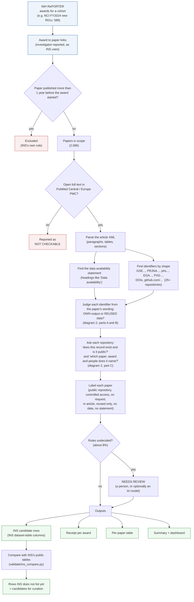
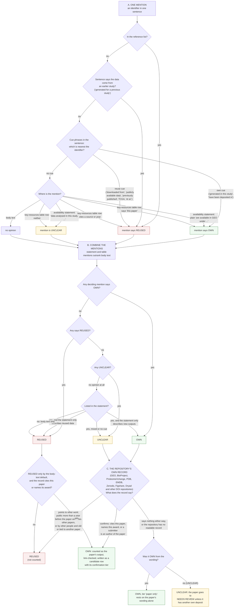

# Output Receipts: process at a glance

Two diagrams: what the tool does (top), and how each identifier is judged "own" or "reused" (bottom).
Plain-language details are in `HOW_IT_WORKS.md`; code-level details in `MAINTAINING.md`.

## 1. The pipeline

No AI runs anywhere in this pipeline. The optional AI step is only "NEEDS REVIEW" (a person can do it) and the
separate accuracy audits in `validate/`.

## 2. Own or reused? (one identifier in one paper)

An identifier can be mentioned several times in a paper. Each mention is judged from its own sentence (part A), the
mentions are combined into one answer per identifier (part B), and the answer is then compared with what the
repository's own record says (part C). Parts A and B read the paper; part C reads the repository.

"Nearest cue" has two refinements: an own cue beats vague reuse wording such as "from the Sequence Read Archive" at
any distance, and inside the statement a cue in the sentence just before the identifier's sentence is used when its
own sentence has none. The code is `mention_role` and `analyze` in `receipts/extract.py` (parts A and B), and
`receipts/records.py` with `receipts/crosscheck.py` (part C).
